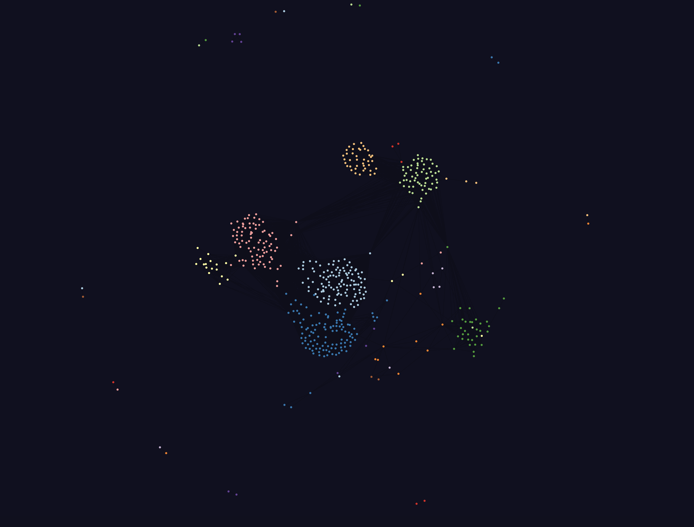

## A 2D force graph visualization of Bacterial Microcompartment Loci Clustering

This repository contains an implementation of Axen's BMC loci clustering algorithm [^1] in python, visualized with a [2D Force Graph](https://github.com/vasturiano/force-graph).

To run this just pull down the repository and host the `index.html` file.

[^1]: *Axen, S. D., Erbilgin, O., & Kerfeld, C. A.* (2014). **A taxonomy of bacterial microcompartment loci constructed by a novel scoring method**. PLoS Computational Biology, 10(10), e1003898. 

